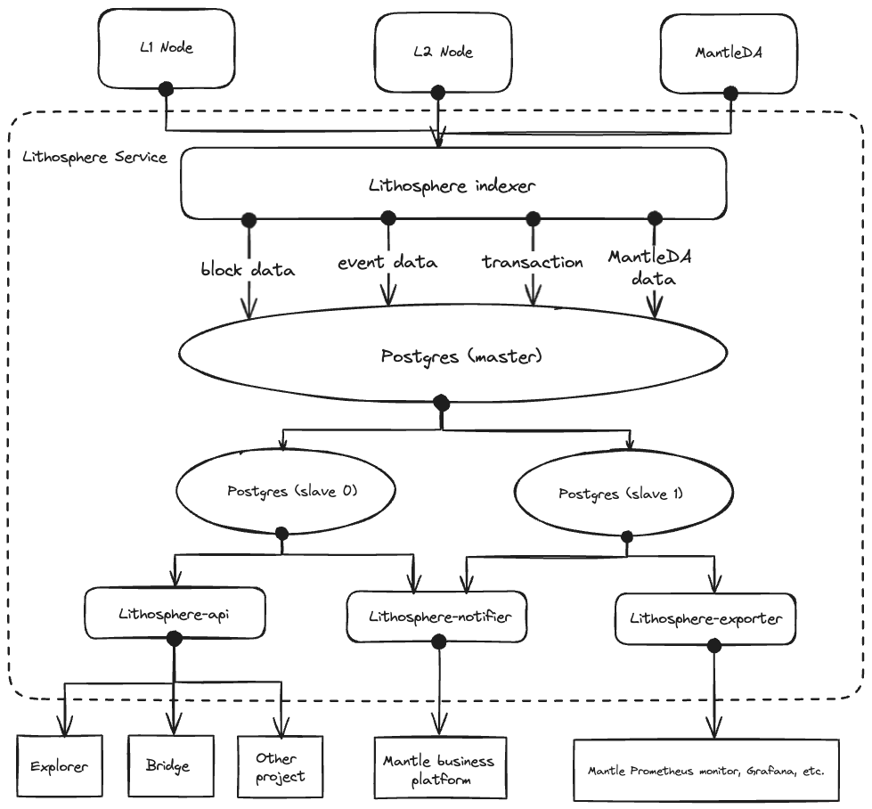

# Architecture

The Lithosphere application consists of three services:

- **Lithosphere API**: Provides a lightweight API supporting paginated lookups for bridge events.
- **Lithosphere Service**: A polling-based service reading and persisting OP Stack chain data from L1 and L2 chains.
- **Lithosphere Exporter**: Mantle chain and Layer monitor metrics.

### Lithosphere API

Lithosphere API is an upper level API service that interacts with the database. It acts as an interface for external parties, such as bridges and browsers, to access the data.The key features of Lithosphere API include:

- **Data Retrieval:** Lithosphere API retrieves data from the database, providing access to data about deposits, withdrawals, state roots, and MantleDA activity.
- **API Accessibility:** It provides a user-friendly API that allows bridges and browsers to easily access and utilize synchronized data.

Here is the [API doc](./api/README.md).

### Lithosphere Service

Lithosphere Service is the powerful engine responsible for handling data synchronization. It synchronizes data from Layer1, Layer2 and MantleDA and processes the data before storing it in the main database. Here are its features:

- **Data Synchronization:** Lithosphere-Service seamlessly synchronizes data from Layer1, Layer2 and MantleDA to ensure that all relevant information is captured.
- **Data Processing:** Once the data has been synchronized, the Lithosphere-Service processes it to differentiate between deposits, withdrawals, status roots and MantleDA-related data.
- **Database Integration:** The processed data is then efficiently stored in the main database for further use.

### Database

The Lithosphere service supports a Postgres database for storing L1/L2 OP Stack chain data. Find the latest database schemas in the `./migrations` directory.
